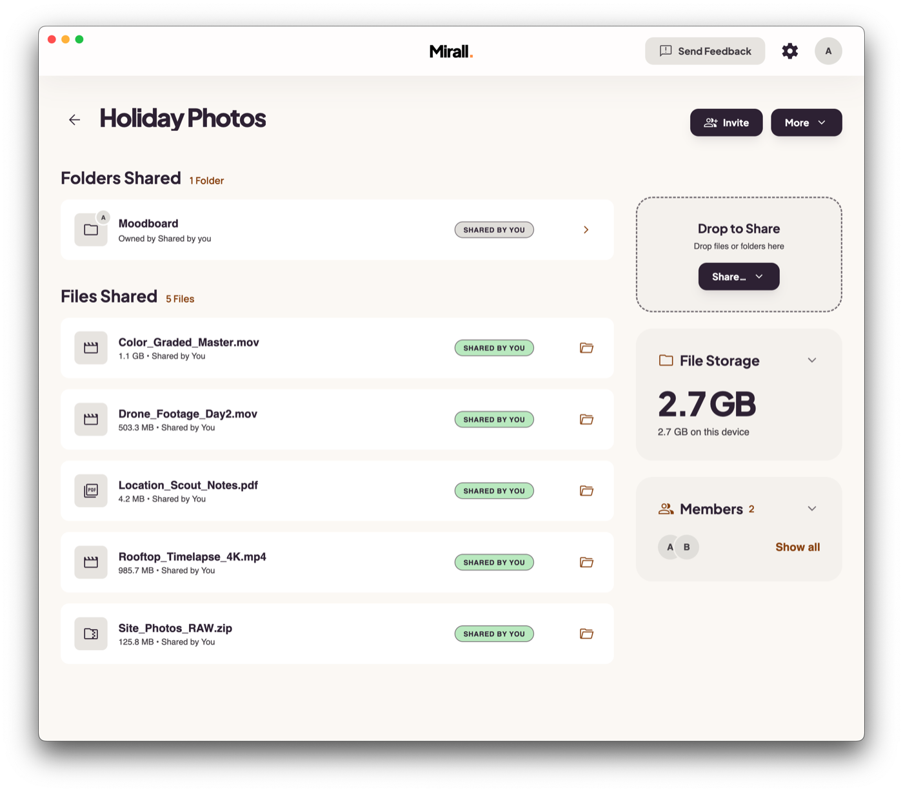

<p align="center">
  <a href="https://mirall.app">
    <picture>
      <source media="(prefers-color-scheme: dark)" srcset="docs/media/wordmark-dark.png">
      
    </picture>
  </a>
</p>

<p align="center">
  Secure large file transfer. No cloud. No middleman.
  <br>
  <a href="https://mirall.app"><strong>mirall.app »</strong></a>
  <br>
  <br>
  <a href="https://mirall.app/docs">Docs</a>
  ·
  <a href="https://mirall.app/changelog">Changelog</a>
  ·
  <a href="https://github.com/ok/mirall-app/issues">Report a bug</a>
</p>

<p align="center">
  <a href="https://github.com/ok/mirall-app/actions/workflows/test.yml"></a>
  <a href="./LICENSE"></a>
  
</p>

---

Mirall moves terabyte-scale files directly between devices. You and the people you share with
form private **spaces**; files transfer peer-to-peer over end-to-end encrypted connections —
no third-party servers, no cloud storage, GDPR-compliant by architecture. Built for workflows
where files are huge and privacy is non-negotiable.

<picture>
  <source media="(prefers-color-scheme: dark)" srcset="docs/media/hero-dark.png">
  
</picture>

## Goals

1. **Direct.** Bytes go from one member's disk to another's — never through a server. Peers
   find each other over a global DHT and connect over encrypted sockets.
2. **Private.** Everything is end-to-end encrypted. Joining a space is approved
   *cryptographically*: approval hands the newcomer the space's content key — without it,
   file listings are unreadable and peers refuse to serve a single byte.
3. **Built for big files.** Files are shared **in place** — no second copy, no staging
   upload. Transfers are content-addressed, verified chunk by chunk, and resume exactly
   where they stopped, even after a restart. Terabyte-scale files are a design target, not
   an edge case.
4. **Local-first.** Everything persists on your machine and keeps working offline.
   The entire client is free software (AGPL-3.0).

## Features

- **Spaces** — private groups for sharing; create one, send an invite, approve who joins
- **Invite links** with optional expiry, auto-approve policy, and per-link revocation
- **Folder shares** — publish a whole directory; members browse it, pick single files, or
  **mirror** it to a local folder that stays in sync (read-only, deletion-safe)
- **Resumable transfers** — automatic pause when a peer goes offline, automatic resume on
  reconnect, no re-downloading of verified data
- **Automatic updates over P2P** — the app updates itself through the same peer-to-peer
  network it shares files on
- Native notifications, system tray, `mirall://` invite deep links, command palette,
  light & dark themes, English · Deutsch · Español · Français · Italiano

## Download

The easiest way to get Mirall is from **[mirall.app](https://mirall.app)**. Direct downloads
of the latest release:

| Platform | Download |
|---|---|
| macOS (Apple silicon) | [Mirall.dmg](https://dl.mirall.app/desktop/latest/darwin-arm64/Mirall.dmg) |
| macOS (Intel) | [Mirall.dmg](https://dl.mirall.app/desktop/latest/darwin-x64/Mirall.dmg) |
| Windows 10/11 (x64) | [Mirall.msix](https://dl.mirall.app/desktop/latest/win32-x64/Mirall.msix) |
| Linux (x64) | [Mirall.AppImage](https://dl.mirall.app/desktop/latest/linux-x64/Mirall.AppImage) |
| Linux (arm64) | [Mirall.AppImage](https://dl.mirall.app/desktop/latest/linux-arm64/Mirall.AppImage) |

> [!NOTE]
> After the first install, Mirall keeps itself up to date automatically — new releases are
> distributed over the same peer-to-peer network and applied on the next start.

**Signed releases:** the macOS app is code-signed and notarized by Apple; the Windows MSIX
is signed with a Certum code-signing certificate; the Linux AppImage is unsigned, as is
common for AppImages.

## How it works

- A space is a random 256-bit topic on the [Hyperswarm](https://github.com/holepunchto/hyperswarm)
  DHT. Members discover each other there and talk over encrypted (Noise) sockets — the invite
  code never touches a server.
- Sharing a file **advertises metadata, not bytes**: the file is hashed once, in place, and its
  entry lands in the space's encrypted catalog. Your disk stays the only copy until someone
  asks for the file.
- Downloads are **content-addressed**: the receiver fetches chunks by hash from any online
  member who holds the file, verifies each chunk as it arrives, and lands the result next to
  a resume journal — interruptions continue instead of starting over.
- Access control is cryptography, not UI: membership approval hands over the space content
  key, and every protocol frame is signed by the sender's identity, bound to its connection.
- The data layer runs on the [Holepunch](https://docs.pears.com) stack (Hypercore, Hyperbee,
  Hyperswarm, Corestore) inside a [Bare](https://github.com/holepunchto/bare) worker process,
  hosted by Electron.

The full design — process model, data model, security model, glossary — is documented in
[`.claude/solution-architecture.md`](./.claude/solution-architecture.md).

## Using Mirall

1. **First launch** — pick a display name (and optionally an avatar).
2. **Create a space** — name it, pick an icon, and share the invite code or `mirall://` link.
3. **Approve** — when someone joins, you (or any member) approve them; approval is what makes
   the space's contents readable to them.
4. **Share** — drop files into the space, or add a whole folder as a share. Members download
   what they want, when they want; nothing syncs without consent.

Step-by-step guides live in the [documentation](https://mirall.app/docs).

## Building from source

Prerequisites: [Node.js](https://nodejs.org) 22+.

```bash
git clone https://github.com/ok/mirall-app.git
cd mirall-app
npm ci
npm start        # build + launch the app (updates disabled)
```

For iterative development, `npm run dev` runs esbuild + Tailwind in watch mode with a
hot-reloading renderer. Useful flags: `--storage <dir>` (separate data directory — enables
multiple instances), `--no-updates`, `--menu` (show the menu on Windows/Linux). DevTools:
<kbd>F12</kbd> / <kbd>Ctrl-Shift-I</kbd> (<kbd>Cmd-Opt-I</kbd> on macOS).

### Two-peer testing

Mirall is a P2P app — most features need **two or more running instances**. Electron's
single-instance lock prevents two copies of the same build from running at once, so use one
dev instance plus one packaged instance:

```bash
npm run dev                                          # instance 1
npm run package                                      # then, instance 2:
out/Mirall-darwin-*/Mirall.app/Contents/MacOS/Mirall --storage /tmp/mirall-peer2
```

### Tests

`npm test` runs the unit, two-peer flow, and integration suites (the same gates as CI).
The frontend suite (`npm run test:fe`) drives the real app through the macOS accessibility
tree and runs locally only. See [CONTRIBUTING.md](./CONTRIBUTING.md) for the testing and
accessibility bar.

## Project structure

| Path | Purpose |
|---|---|
| `src/main/` | Electron main process — window, tray, updater, worker spawn, IPC relay |
| `src/preload/` | The `window.bridge` surface exposed to the sandboxed renderer |
| `src/renderer/` | React UI (TypeScript + Tailwind) |
| `src/worker/` | Bare worker entrypoint — boot sequence + IPC command handlers |
| `src/shared/` | The worker's data layer: stores, spaces, transfers, folder sync |
| `test/` | Unit, integration, two-peer flow, and frontend suites |
| `scripts/` | Build and maintenance scripts |
| `.github/workflows/` | CI: tests and multi-platform release builds |

## Contributing

Contributions are welcome — read [CONTRIBUTING.md](./CONTRIBUTING.md) for the development
setup, testing discipline, and the CLA (signed once, automatically, on your first pull
request). Translations currently cover English, German, Spanish, French, and Italian;
corrections and new languages are appreciated.

## Security

Mirall is end-to-end encrypted: space contents are readable only with a per-space key that
members receive upon approval, and every peer connection is authenticated and encrypted.
If you believe you've found a vulnerability, please **do not open a public issue** — see
[SECURITY.md](./SECURITY.md) for how to report it privately.

## Acknowledgements

Mirall's content-addressed transfer layer builds on the work by **fleeky** and his **hyper-overlay** framework — thank you.

## License

This repository is **100% free and open source** under the [GNU AGPL-3.0](./LICENSE) —
use it, study it, modify it, share it.
